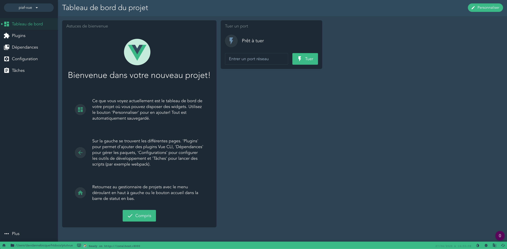
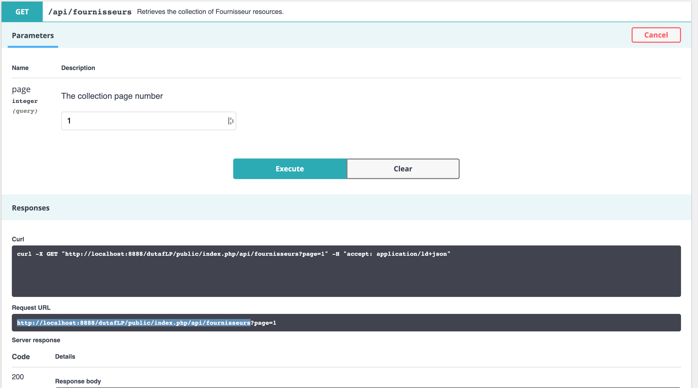
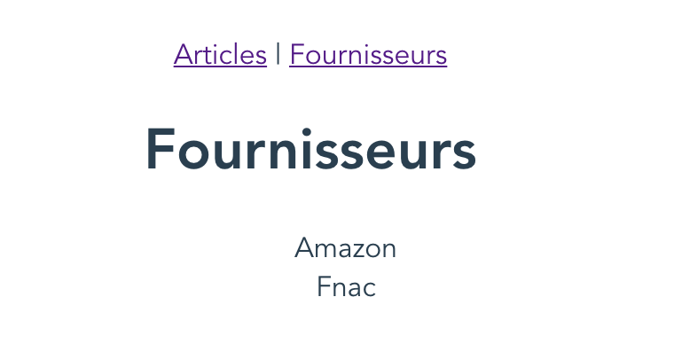

# Formulaires dynamiques avec Symfony

Il est fréquent d'avoir besoin de lier plusieurs éléments d'un formulaire. Par exemple proposer des villes en fonction d'une région ou d'un code postal. Naturellement pour réaliser ce type de mécanisme vous devriez mettre en place des appels en javascript pour actualiser les élements en fonction des autres.

Ce besoin étant récurrent dans les interfaces, Symfony l'intégre en mettant en place un système d'événements qui peuvent se déclencher et mettre à jour le formulaire. Vous trouverez la [documentation complète ici](https://symfony.com/doc/current/form/dynamic_form_modification.html).

Pour cela on va manipuler les Events des formulaires. Il en existe plusieurs :

* PRE_SET_DATA
* POST_SET_DATA
* PRE_SUBMIT
* SUBMIT
* POST_SUBMIT

Le principe de fonctionnement est le suivant :

A chaque changement du select des régions, le formulaire est soumis à Symfony (de manière automatique et transparente).
Cette opération va récupérer les éléments associés à la Région et les renvoyer afin de mettre à jour le select des villes.

# API Rest et "AJAX"

Cette partie a pour objectif de voir la mise en place d'un système d'API Rest sur un projet Symfony, ainsi que la 
manipulation de cette API en utilisation de l'AJAX.

## API

Un système d'API Rest est un système qui selon une URL et une méthode HTTP retourne des données, généralement sous un format JSON.
Il existe plusieurs méthodes pour mettre cela en place sur un projet Symfony. On pourrait utiliser FOSRestBundle par exemple, puis un mécanisme de sérialization qui permet la transformation des données en un format JSON manipulable par le front.

Il existe aussi un bundle nommé [API Platform](https://api-platform.com/) développée, entre autre, par [Kevin Dunglas](https://twitter.com/dunglas).
L'installation de ce bundle permet d'obtenir un système d'API complet, avec la génération du format de "sortie" en JSON (et bien d'autres). API Platform propose en plus une interface très complète afin d'avoir la documentation de son API, mais aussi de pouvoir tester son fonctionnement.
API Platform propose de nombreuses librairie afin de générer la partie front (VueJs, React), et même une administration complète à base de React.

### Installation

L'installation est très simple (sans un projet déjà existant) :

````
composer require api
````

Vous pouvez ensuite voir le résultat directement

````
http://votreprojet/api
````

Pour le moment rien ne s'affiche, car aucune entitée n'est associée à API Platform.
Pour ajouter une entiée, ouvrez le fichier "fournisseur.php" et ajoutez :

````
* @ApiResource
````

Juste avant le nom de la classe, sans oublier :

````
use ApiPlatform\Core\Annotation\ApiResource;
````

#### Mise en pratique

On va repartir sur une base de DUTAF avec Symfony. Pensez à supprimer les éventuels anciens projets ou les renommer. Les Elements se trouve ici : [Application de démonstration](demo.md)

Ensuite, installer ApiPlatform

````
composer require api
````

Il ne vous reste plus qu'a définir quelles sont les entitées que vous voulez gérer avec ApiPlatform en modifiant les fichiers.


Soit, par exemple, pour notre entité Fournisseur :

````
<?php

namespace App\Entity;

use ApiPlatform\Core\Annotation\ApiResource;
use Doctrine\Common\Collections\ArrayCollection;
use Doctrine\Common\Collections\Collection;
use Doctrine\ORM\Mapping as ORM;

/**
 * @ORM\Entity(repositoryClass="App\Repository\FournisseurRepository")
 * @ApiResource()
 */
class Fournisseur
{
...
}
````

**Ajoutez quelques données dans les deux tables (2 fournisseurs et 4 produits par exemple), afin de pouvoir tester.**

Rechargez votre navigateur, et voilà !

Sans aucune autre configuration, vous avez une API qui permet de manipuler votre entité Fournisseur. 
Vous pouvez lister les fournisseurs, en ajouter un, en modifier, ou en supprimer, ou encore avoir le détail d'un enregistrement précis.


### Test une API avec POSTMAN

On peut utiliser l'interface proposée par API Platform pour regarder le comportement de notre API. On peut aussi, afin d'avoir un comportement plus proche d'un appel "front" utiliser l'instruction CURL en ligne de commande, ou enfin, utiliser un outil comme [Postman](https://www.getpostman.com/) qui permet de faire des appels comme le ferait notre interface front. Cet outil est très pratique pour déterminer la structure des URL et des données à fournir, ou des données récupèrée.

1. [Téléchargez et installer PostMan](https://www.getpostman.com/downloads/)
2. Un compte est nécessaire.
3. Lancez Postman et executez une première requête
4. http://votrprojet/public/index.php/api/fournisseurs
5. Regardez la réponse proposée par API Platform

Par défaut, API Platform propose un format enrichi du JSON ([Json-LD](https://json-ld.org/)), qui contient des informations supplémentaires : 

````
{
    "@context": "/dutaflp/public/index.php/api/contexts/Fournisseur",
    "@id": "/dutaflp/public/index.php/api/fournisseurs",
    "@type": "hydra:Collection",
    "hydra:member": [
        {
            "@id": "/dutaflp/public/index.php/api/fournisseurs/1",
            "@type": "Fournisseur",
            "id": 1,
            "nom": "Four 1",
            "telephone": "0987654321",
            "ville": "Troyes",
            "articles": []
        },
        {
            "@id": "/dutaflp/public/index.php/api/fournisseurs/2",
            "@type": "Fournisseur",
            "id": 2,
            "nom": "Amazon",
            "telephone": "0987678909",
            "ville": "Paris",
            "articles": []
        }
    ],
    "hydra:totalItems": 2
}
````

### A vous de jouer

Testez depuis Postman : 

* l'URL pour obtenir les informations d'un fournisseur, 
* l'URL pour ajouter un fournisseur
* l'URL pour modifier un fournisseur.

### A vous de jouer encore

Ajoutez l'entité Article dans Api Platform.

## Filtrer les opérations

Par défaut, API Platform propose toutes les manipulations classiques d'un CRUD. Il est possible d'interdire des opérations ou d'en ajouter (opérations personnalisées).

Pour interdire une opération, il faut, au niveau de l'entité, lister les opérations autorisées. Par exemple :

````
 * @ApiResource(
 *     collectionOperations={"get"},
 *     itemOperations={"get"}
 * )
 
 */
class Fournisseur
````

Cet exemple autorise, uniquement un accès GET sur la collection, autrement dit, la possibilité de récupérer tous les enregistrements, et un accès GET sur un item, autrement dit, récupérer toutes les informations d'un élémént précis.

## Faire des requêtes AJAX avec Symfony

### Principes
Executer un appel avec AJAX depuis le front est en fait très simple et ne change pas particulièrement lorsque l'on utilise Symfony. En effet Symfony permet uniquement d'envoyer des données depuis le serveur vers le front.

La difficulté peut provenir de l'URL à utiliser lors de l'appel. Plusieurs solutions peuvent exister :

* Utiliser l'instruction TWIG : path, si le code javascript est dans un fichier twig.
* Utiliser une URL (absolue ou relative) dans du code javascript
* Utiliser un bundle permettant de manipuler les noms des routes depuis du javascript : [FOSJsRouting](https://symfony.com/doc/master/bundles/FOSJsRoutingBundle/index.html)

### Première requête

On peut écrire par exemple le code ci-dessous, sur la page d'index pour obtenir la liste des fournisseurs.

````
<script>
$(document).ready(function(){
    $.ajax({
      url: 'http://localhost:8888/dutaflp/public/index.php/api/fournisseurs',
      success: function (data) {
        console.log(data)
      }
    })
})
</script>
````

Le résultat s'affiche dans la console.

### A vous de jouer

En vous basant sur API plateforme, écrire une page simple, qui permet de lister, ajouter et voir le détail des fournisseurs en utilisant jquery (ou éventuellement un framework front que vous maitrisez, la partie front peut être en dehors d'un projet Symfony).

## Outils proposés par API Platform

API Platform propose de nombreuses manières de gérer la partie Front. 

Notamment une administration auto-genérée, basée sur React (React-Admin), [https://api-platform.com/docs/admin/](https://api-platform.com/docs/admin/).

Api Platform propose aussi des générateurs (qui vont produire le code et les fichiers associés) notamment pour les framework React et VueJs, mais aussi pour des applications mobiles (React Native) [https://api-platform.com/docs/client-generator/](https://api-platform.com/docs/client-generator/)

### A vous de jouer

Mettez en place l'administration à base de React-Admin pour notre projet.

## A lire

Une présentation faite lors du SymfonyCon de Paris : [https://dunglas.fr/2019/03/symfonylive-paris-slides-symfony-on-steroids%e2%80%a8-vue-js-mercure-panther/](https://dunglas.fr/2019/03/symfonylive-paris-slides-symfony-on-steroids%e2%80%a8-vue-js-mercure-panther/) sur l'intégration de Symfony, VueJs et mercure afin de rendre vos applications plus intéractives avec une base Symfony.

## Manipulation des données avec ApiPlatform et VueJS (ou autre framework front)

Dans cette dernière partie, nous allons voir comment manipuler, en partant de rien, les données issues d'ApiPlatform et comment authentifier les échanges avec un token (on utilisera JWTToken).

Vous allez créer un nouveau projet VueJs.

Je vous propose pour ceux qui souhaitent le faire avec VueJS, d'utiliser un utilitaire très pratiques Vue-CLI (https://cli.vuejs.org/). Vue CLI propose une interface graphique (en plus des commandes pour créer un projet en ligne de commande) pour gérer ses projets VueJS.

L'installation de Vue-Cli se fait avec Node ou Yarn.

```
npm install -g @vue/cli
# OR
yarn global add @vue/cli
```

Il suffit ensuite de lancer Vue-Cli avec la commande suivante :

```
vue ui
```

Vous devriez obtenir une interface de ce type :



Démonstration pour la création d'un projet.
On nommera le projet **vueDutaf** (avec les presets par défaut).

On va ensuite ajouter vue-router et axios (on pourrait utiliser le fecth natif également), grâce à l'interface graphique (dépendances => ajouter une dépendance)

L'objet de ce module n'étant pas forcément VueJS, vous pouvez simplement récupérer le dépot initial en execuatant les commandes ci-dessous

```
git clone https://github.com/Dannebicque/vuedutaf.git
cd vuedutaf
npm install
npm run serve
```

### Créer une application sans Vue ui

https://cli.vuejs.org/guide/creating-a-project.html#vue-create

### Créer une première page pour afficher les fournisseurs

On va lister les fournisseurs dans la page Fournisseurs. Pour cela, on va éditer le composant Fournisseurs.vue
En explorant la document générée par ApiPlatform, on voit que l'URL pour collecter tous les fournisseurs (avec éventuellement une pagination est : http://localhost:8888/dutafLP/public/index.php/api/fournisseurs (localhost dans mon cas).



On va donc ajouter une méthode dans le composant fournisseur pour qu'il récupère tous les fournisseurs lorsque la page est "montée".

Pour cela, on pourrait avoir une méthode pour récupérer les données qui ressemblerait à 

```js
async mounted () {
  this.items = await axios.get('http://localhost:8888/dutafLP/public/index.php/api/fournisseurs'
  ).then(req => {
    console.log(req.data)
    return req.data['hydra:member']
  })
},
```

this.items correspond à une variable permettant de récupérer les données et de les exploiter :
```js
data: function () {
  return {
    items: {}
  }
},
```

Puis l'affichage, par exemple : 
```
<ul>
  <li v-for="item in items" :key="item.id">{{item.nom}}</li>
</ul>
```

Vous devriez avoir la liste des fournisseurs affichée :




### A vous de jouer

1. Faite la même chose pour afficher les articles.
2. Comment pourriez vous faire pour afficher les détails d'un article lorsque je clique dessus ? Regardez bien le résultat retourné par ApiPlatform...
3. Proposez un "CRUD" pour la gestion des fournisseurs (avec a minima ajout et modification) en utilisant l'API avec les requêtes POST et PUT.

### Rendu
pour 12h00, vous m'enverrez sur discord (en PV), une capture d'écran de vos pages et les fichiers sources (.vue, .html, .js selon l'outil front utilisé) (ou un lien)


### Authentifier les échanges avec JWT

Pour info. Optionnel.

Installer et configurer JWT
https://api-platform.com/docs/core/jwt/

Puis ensuite utiliser le Token dans vos échanges entre le front et le back.

La première chose est d'authentifier votre utilisateur en envoyant login et password au Back, avec par exemple le code ci-dessous

```js
axios({url: 'http://localhost:8888/ptutApi/public/index.php/authentication_token', data: {username:username, password:password}, method: 'POST' }) //username et password proviennent du formulaire
          .then(resp => {
            const token = resp.data.token
            const userData = atob(resp.data.token.split('.')[1]) //on récupère les données de l'utilisateur, par défaut, login, rôles
            localStorage.setItem('user', userData) // store the user in localstorage
            localStorage.setItem('usertoken', token) // store the token in localstorage
            router.push('/')
          })
          .catch(err => {
            localStorage.removeItem('user-token') // if the request fails, remove any possible user token if possible
          })
```

Il faut ensuite envoyer sur chaque requête du front vers le back, le token précédemment récupéré pour authentifier les échanges.

Par exemple avec Axios.
```js
axios.post(url, {
  headers: {
    'Authorization': `Bearer ` + localStorage.getItem('usertoken')
  }
})
```

