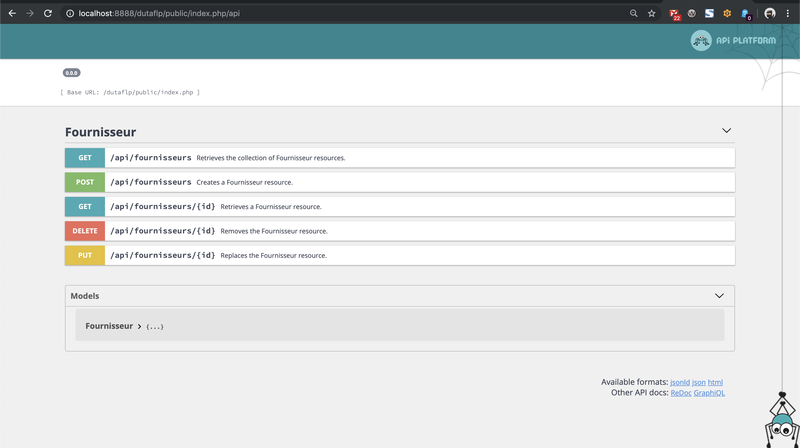

# API Rest et "AJAX"

Cette partie a pour objectif de voir la mise en place d'un système d'API Rest sur un projet Symfony, ainsi que la 
manipulation de cette API en utilisation de l'AJAX.

## API

Un système d'API Rest est un système qui selon une URL et une méthode HTTP retourne des données, généralement sous un format JSON.
Il existe plusieurs méthodes pour mettre cela en place sur un projet Symfony. On pourrait utiliser FOSRestBundle par exemple, puis un mécanisme de sérialization qui permet la transformation des données en un format JSON manipulable par le front.

Il existe aussi un bundle nommé [API Platform](https://api-platform.com/) développée, entre autre, par [Kevin Dunglas](https://twitter.com/dunglas).
L'installation de ce bundle permet d'obtenir un système d'API complet, avec la génération du format de "sortie" en JSON (et bien d'autres). API Platform propose en plus une interface très complète afin d'avoir la documentation de son API, mais aussi de pouvoir tester son fonctionnement.
API Platform propose de nombreuses librairie afin de générer la partie front (VueJs, React), et même une administration complète à base de React.

### Installation

L'installation est très simple :

````
composer require api
````

Vous pouvez ensuite voir le résultat directement

````
http://votreprojet/api
````

Pour le moment rien ne s'affiche, car aucune entitée n'est associée à API Platform.
Pour ajouter une entiée, ouvrez le fichier "fournisseur.php" et ajoutez :

````
* @ApiResource
````

Juste avant le nom de la classe, sans oublier :

````
use ApiPlatform\Core\Annotation\ApiResource;
````


Soit pour notre fichier :

````
<?php

namespace App\Entity;

use ApiPlatform\Core\Annotation\ApiResource;
use Doctrine\Common\Collections\ArrayCollection;
use Doctrine\Common\Collections\Collection;
use Doctrine\ORM\Mapping as ORM;

/**
 * @ORM\Entity(repositoryClass="App\Repository\FournisseurRepository")
 * @ApiResource()
 */
class Fournisseur
{
...
}
````

Rechargez votre navigateur, et voilà !

Sans aucune autre configuration, vous avez une API qui permet de manipuler votre entité Fournisseur. 
Vous pouvez lister les fournisseurs, en ajouter un, en modifier, ou en supprimer, ou encore avoir le détail d'un enregistrement précis.



### Test une API avec POSTMAN

On peut utiliser l'interface proposée par API Platform pour regarder le comportement de notre API. On peut aussi, afin d'avoir un comportement plus proche d'un appel "front" utiliser l'instruction CURL en ligne de commande, ou enfin, utiliser un outil comme [Postman](https://www.getpostman.com/) qui permet de faire des appels comme le ferait notre interface front. Cet outil est très pratique pour déterminer la structure des URL et des données à fournir, ou des données récupèrée.

1. [Téléchargez et installer PostMan](https://www.getpostman.com/downloads/)
2. Un compte est nécessaire.
3. Lancez Postman et executez une première requête
4. http://votrprojet/public/index.php/api/fournisseurs
5. Regardez la réponse proposée par API Platform

Par défaut, API Platform propose un format enrichi du JSON ([Json-LD](https://json-ld.org/)), qui contient des informations supplémentaires : 

````
{
    "@context": "/dutaflp/public/index.php/api/contexts/Fournisseur",
    "@id": "/dutaflp/public/index.php/api/fournisseurs",
    "@type": "hydra:Collection",
    "hydra:member": [
        {
            "@id": "/dutaflp/public/index.php/api/fournisseurs/1",
            "@type": "Fournisseur",
            "id": 1,
            "nom": "Four 1",
            "telephone": "0987654321",
            "ville": "Troyes",
            "articles": []
        },
        {
            "@id": "/dutaflp/public/index.php/api/fournisseurs/2",
            "@type": "Fournisseur",
            "id": 2,
            "nom": "Amazon",
            "telephone": "0987678909",
            "ville": "Paris",
            "articles": []
        }
    ],
    "hydra:totalItems": 2
}
````

### A vous de jouer

Testez depuis Postman : 

* l'URL pour obtenir les informations d'un fournisseur, 
* l'URL pour ajouter un fournisseur
* l'URL pour modifier un fournisseur.

### A vous de jouer encore

Ajoutez les entités User et Article dans Api Platform.

## Faire des requêtes AJAX avec Symfony

### Principes
Executer un appel avec AJAX depuis le front est en fait très simple et ne change pas particulièrement lorsque l'on utilise Symfony. En effet Symfony permet uniquement d'envoyer des données depuis le serveur vers le front.

La difficulté peut provenir de l'URL à utiliser lors de l'appel. Plusieurs solutions peuvent exister :

* Utiliser l'instruction TWIG : path, si le code javascript est dans un fichier twig.
* Utiliser une URL (absolue ou relative) dans du code javascript
* Utiliser un bundle permettant de manipuler les noms des routes depuis du javascript : [FOSJsRouting](https://symfony.com/doc/master/bundles/FOSJsRoutingBundle/index.html)

### Première requête

On peut écrire par exemple le code ci-dessous, sur la page d'index pour obtenir la liste des fournisseurs.

````
<script>
$(document).ready(function(){
    $.ajax({
      url: 'http://localhost:8888/dutaflp/public/index.php/api/fournisseurs',
      success: function (data) {
        console.log(data)
      }
    })
})
</script>
````

Le résultat s'affiche dans la console.

### A vous de jouer

En vous basant sur API plateforme, écrire une page simple, qui permet de lister, ajouter et voir le détail des fournisseurs en utilisant jquery (ou éventuellement un framework front que vous maitrisez, la partie front peut être en dehors d'un projet Symfony).

## API et ressources liées

gestion de article avec le lien vers le fournisseur

